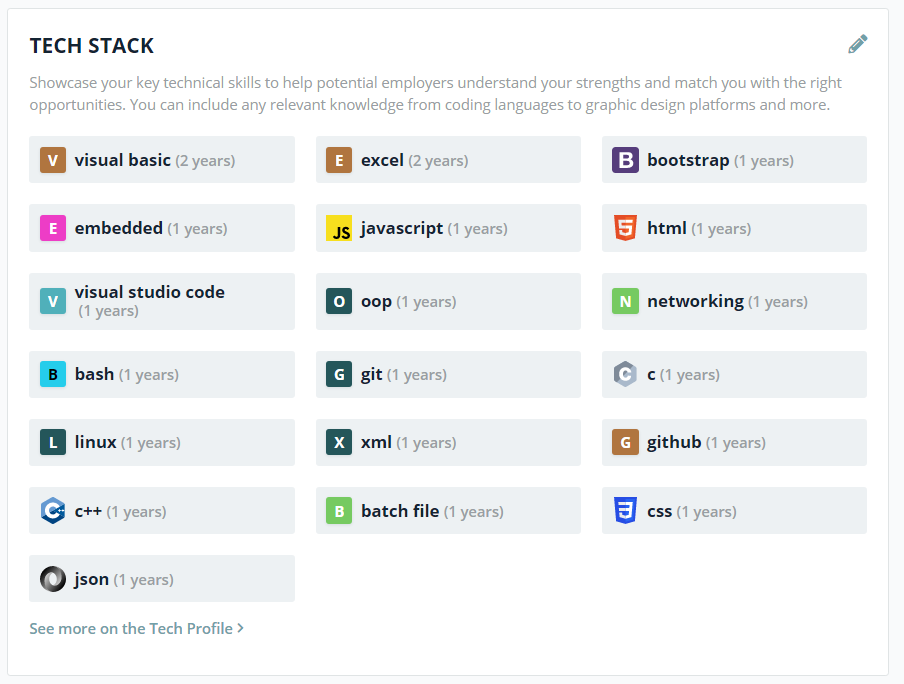

# rhanak1987 GitHub Pages

## About me
* [codersrank profile](https://profile.codersrank.io/user/rhanak1987/info)
* [linkedin profile](https://www.linkedin.com/in/rhanak1987/)

### Tech Stack
Note: This is a broad list including professional experience and other studies as well. Year numbers are not exact. (c. 2020)

<!-- []: # () -->

## Jump to the local content
* Go to the [data samples landing page](./landing.html) to see the contents of this site.

## External contents (leave this site)

### Jump to the sandbox
* [rhanak1987-sandbox.github.io](https://rhanak1987-sandbox.github.io/)

### Quick links (public)
* [hello-world wiki](https://github.com/rhanak1987-sandbox/hello-world/wiki)

### Quick links (private)
* [study time - GitHub project](https://github.com/orgs/rhanak1987-sandbox/projects/1)

###### fin
